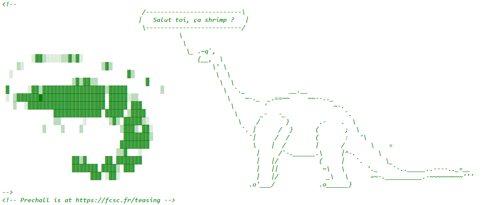
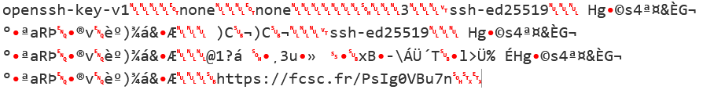
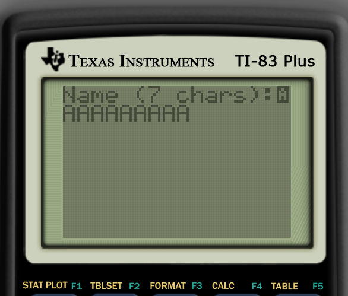
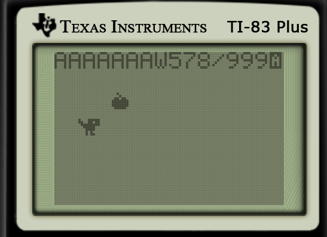
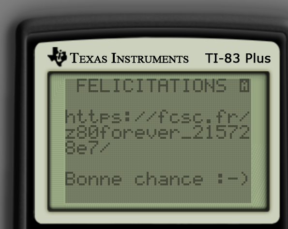

# Prechall FCSC 2026

Chaque année, il y a un préchall pour le FCSC. Le lien vers le préchall est caché dans le code source de la page principale.


https://fcsc.fr/teasing

> Pour vous faire patienter jusqu'au 3 avril 2026 à 14h pour le lancement du FCSC 2026, nous vous proposons cette année encore une épreuve de teasing ! Celui-ci consiste en trois épreuves à résoudre successivement, dont le point de départ est donné ci-dessous. La résolution des trois épreuves vous apportera 1 point symbolique pour le FCSC 2026, et sera matérialisée sur le site par un 🔥 à côté des noms d'utilisateur. 


## Épreuve 1/3

>Vous retrouvez une vieille clé SSH, mais nous ne vous rappelez plus à quoi elle correspond.
> Malheureusement, le commentaire associé dans la clé publique a été perdu.
> 
>Pour cette épreuve, vous allez trouver une URL, celle-ci contient la deuxième étape du prechall.


On a une clé privée et une clé publique corrompue, pas de commentaire. Comme la clé publique est dérivée de la clé privée on peut la reconstituer facilement. On utilise l'option `-y`

```
ssh-keygen -y -f i-ve-lost-my-comment > found-comment.pub

ssh-ed25519 AAAAC3NzaC1lZDI1NTE5AAAAIEhnlalzNKqkJshHrAqwmaphUt4Fg652Bei6Kb7hJp/G https://fcsc.fr/PsIg0VBu7n
```

On pouvait aussi décoder la clé privée en base64 et directement avoir le lien.




## Épreuve 2/3

> Vous trouvez un jeu sur une vieille calculette TI-83+ dans votre grenier.
> Apparemment, il est infinissable.
> Est-ce que vous pourrez réussir là où vos parents ont échoué ?
> 
> Pour cette épreuve, vous allez à nouveau trouver une URL, celle-ci contient la dernière étape du prechall.

On a un binaire pour une calculatrice de type TI-83 Plus
```
file veggie-dino.8xp
veggie-dino.8xp: TI-83+ Graphing Calculator (assembly program)
```

Je me tourne alors sur des émulateurs de TI-83 plus, je tombe sur Wabbitemu (mais d'autres émulateurs fonctionnent aussi).

Quand j'essaie d'exécuter le programme prgmDINO tel quel j'ai une syntax error.

J'ai lancé le programme, j'ai aussi utilisé Asm() vu que c'était un assembly program. [(Ref)](http://tibasicdev.wikidot.com/asm-command)

``Asm(prgmDINO)``

On peut rentrer son nom (7 caractères). On peut alors controller un petit dinosaure qui doit récupérer 999 pommes. C'est long.

En voyant cette limite imposée, je me demandais ce qu'il se passerait si je mettais plus de 7. (Sans même avoir testé le jeu avant...)

J'ai donc mis 9 `A`.




Cela provoque un buffer overflow, on voit que notre nom est corrompu en haut.



En récupérant la première pomme, j'obtiens un message de félicitations et le lien vers la dernière étape.



## Épreuve 3/3

> Lorsque vous aurez trouvé le flag contenu dans cette vidéo, soumettez-le dans le formulaire du point de départ du prechall.
> 
> ⚠️ Attention, le son peut être fort. 


<video controls src="oscillart.webm" title="Etape3"></video>

On voit qu'une sorte d'animation s'affiche, avec le début d'un flag : `FCSC{`

Mais peu de temps après, on ne voit plus rien à part cette image


Il s'agit en fait d'oscillart.

[Une vidéo d'explication](https://youtu.be/aACHxWfsWjU)

Lorsque l'oscilloscope est en mode XY, il forme une image. Mais à partir d'un moment on ne voit plus ce qu'il se passe, donc à partir du signal il faut reconstituer ce que donnerait un oscilloscope.

Je n'avais pas envie de réinventer la route pour le moment, donc j'ai regardé s'il y avait des oscilloscopes en ligne ou des outils pour ça.

Je suis tombé sur ce site qui permet d'importer un fichier audio et affiche le rendu sur un oscilloscope.
ttps://dood.al/oscilloscope/

Je convertis alors mon webm en wav avec audacity.

<audio controls src="oscillart.wav" title="oscillart wav"></audio>

Je peux maintenant lire le flag (avec un peu de difficulté).

```FCSC{vector_flag_9739}```
