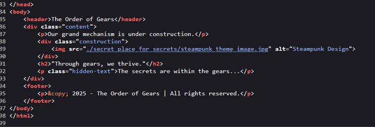
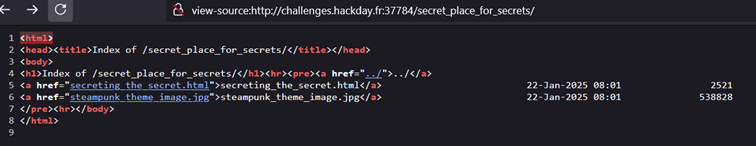
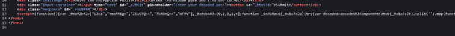
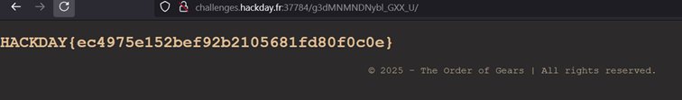

# Web

##  The Watchful Gears: Uncover the Secrets Within

> This website clearly hides a lot of things... be careful, it seems the administrator of this website is monitoring activity! Proceed slowly but surely...This website clearly hides a lot of things... be careful, it seems the administrator of this website is monitoring activity! Proceed slowly but surely...

>Fuzzing is prohibited on this challenge, same as automatic tools like dirbuster. There's no need of enumeration on this challenge, all have to be done manually. Automatic tools usage can be punished.

>challenges.hackday.fr:37784

This is an easy web challenge. 
If we check the source code, there is a suspicious directory.

Let's check that secret_place_for_secrets directory.

 
There's a Js code inside.

     
    

We just have to write a script that finds the correct path. The console can even be used so the code can be pasted there.

    (function() {
        var _0xa92bf2 = ["L2cz", "YmxfR1g=", "ZE1OTQ==", "TkROeQ==", "WF9V"];
        var _0x9cb483 = [0, 2, 3, 1, 4];
    
        function _0x928acd(_0x1a3c2b) {
            try {
                return decodeURIComponent(atob(_0x1a3c2b).split('').map(function(_0x3c48d7){
                    return '%' + _0x3c48d7.charCodeAt(0).toString(16);
                }).join(''));
            } catch(e) {
                return '';
            }
        }
    
        function _0x18ad3c() {
            var _0x47e3bd = '';
            _0x9cb483.forEach(function(_0x2c7d48) {
                var fragment = _0xa92bf2[_0x2c7d48];
                _0x47e3bd += _0x928acd(fragment);
            });
            return _0x47e3bd;
        }
    
        var decodedPath = _0x18ad3c();
        console.log("Decoded Path: " + decodedPath); // This will output the decoded path
    })();
    

The returned path is /g3dMNMNDNybl_GXX_U

http://challenges.hackday.fr:37784/g3dMNMNDNybl_GXX_U/

It automatically redirects to http://challenges.hackday.fr/g3dMNMNDNybl_GXX_U/ which doesnt give anything. Check the source code and change the url back to http://challenges.hackday.fr:37784

