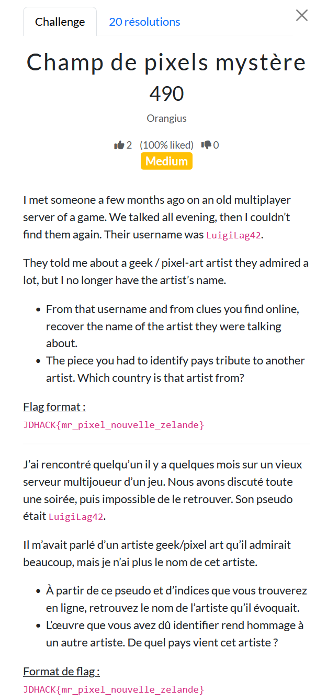
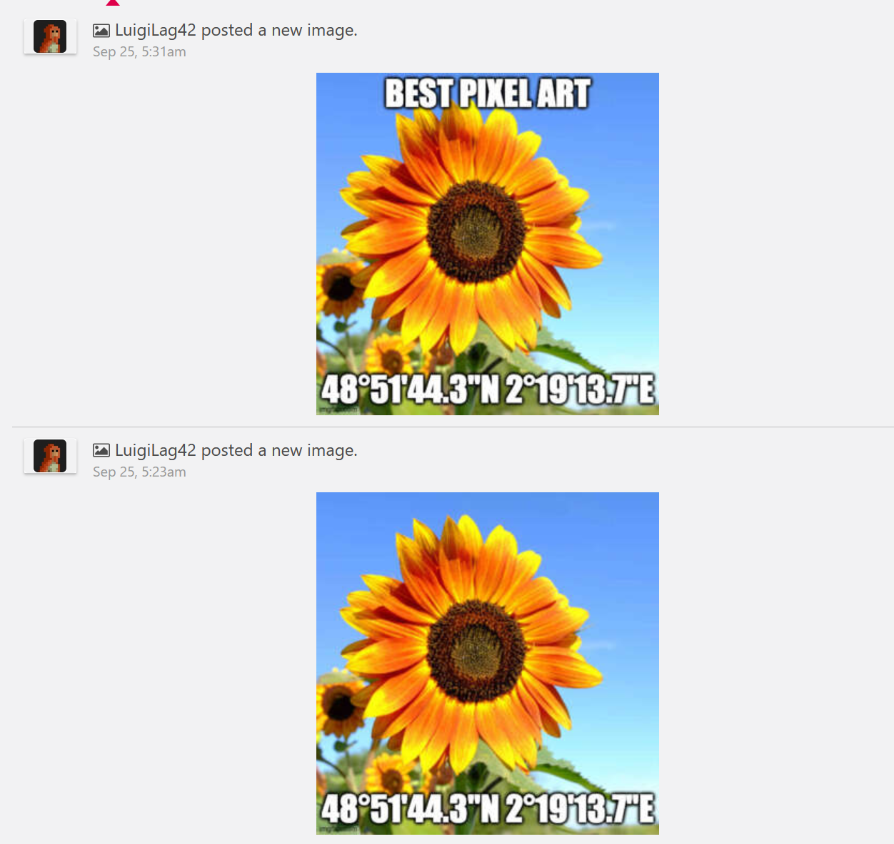
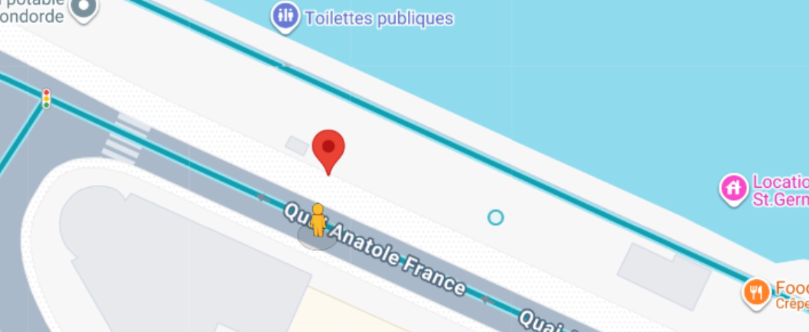
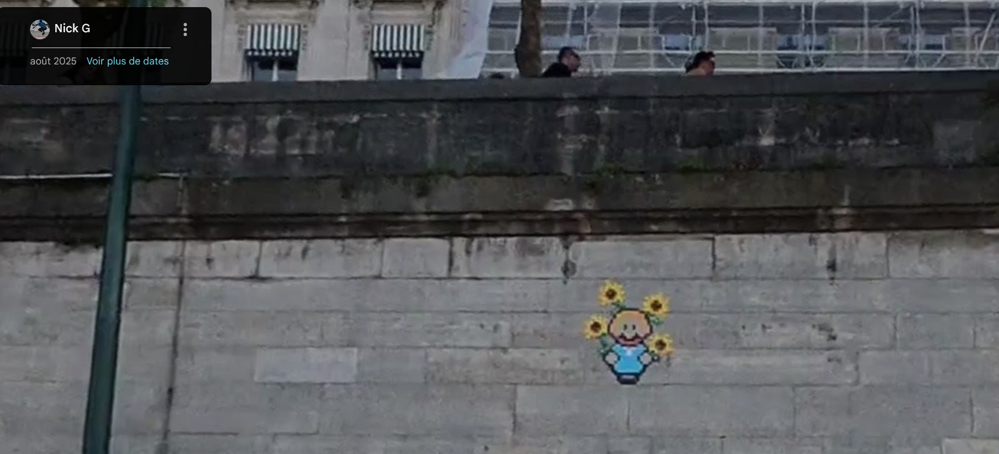
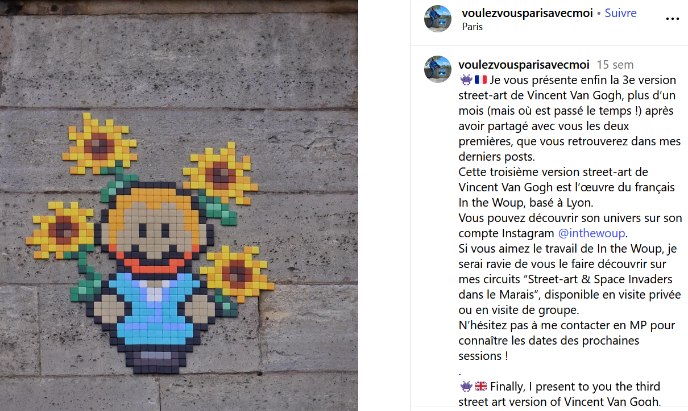

# Champs de pixel mystère

**Difficulté** : Medium | **Points** : 490 | Catégorie : OSINT



En utilisant [Sherlock](https://github.com/sherlock-project/sherlock), on retrouve un compte Gamespot : https://www.gamespot.com/profile/LuigiLag42/



Les coordonnées nous emmènent au Quai Anatole France à Paris.


Il suffit de descendre sur les quais et de choisir la photo la plus récente pour voir un pixel art.

https://maps.app.goo.gl/FDQPvggNQJpRQwuY9



En faisant une recherche inversée, on peut trouver plus de contexte sur la photo.


```
Je vous présente enfin la 3e version street-art de Vincent Van Gogh, plus d’un mois (mais où est passé le temps !) après avoir partagé avec vous les deux premières, que vous retrouverez dans mes derniers posts.
Cette troisième version street-art de Vincent Van Gogh est l’œuvre du français In the Woup, basé à Lyon.
Vous pouvez découvrir son univers sur son compte Instagram @inthewoup.
```

L'artiste est "In The Woup" et rend hommage à Vincent Van Gogh, peintre néérlandais (Pays-Bas). Les Tournesols font d'ailleurs partie des oeuvres les plus connues du peintre (https://fr.wikipedia.org/wiki/Les_Tournesols)

Flag :
```JDHACK{in_the_woup_pays_bas}```