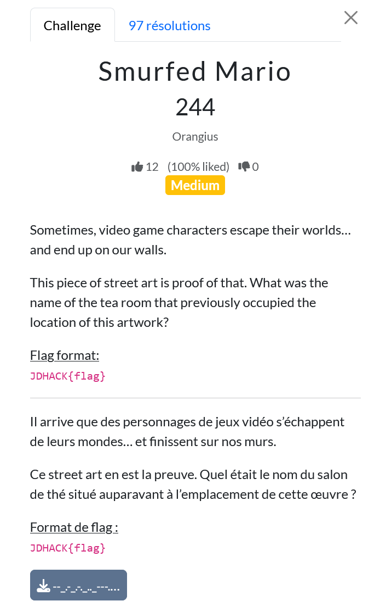
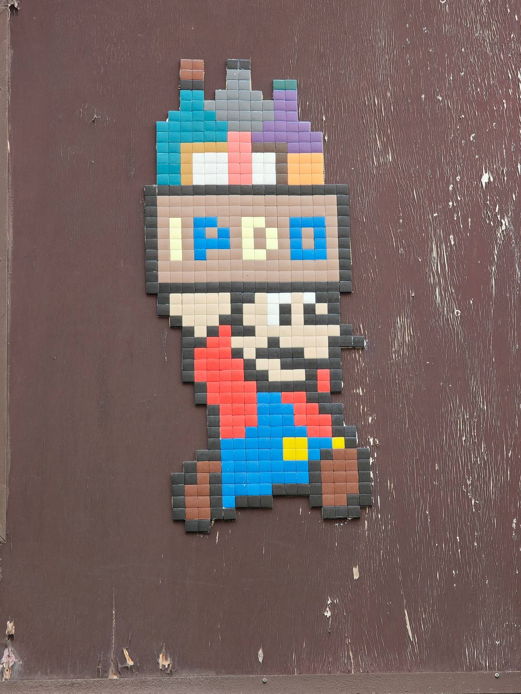
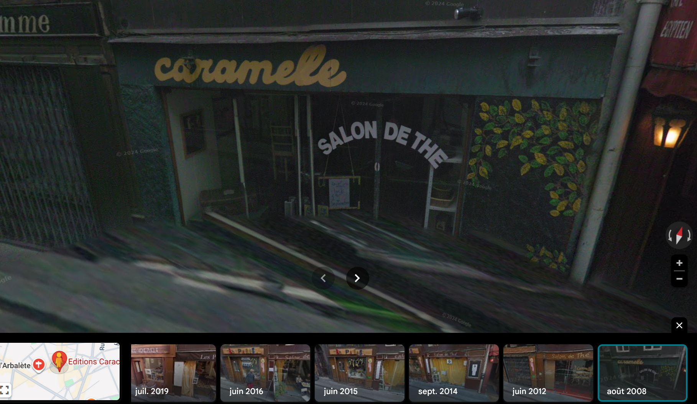

# Smurfed Mario

En faisant des recherches sur IPDO, on découvre qu'il s'agit de "I Pixel Di Oplontis", un duo d'artistes connu pour faire des pixel arts de Schtroumpfs. A l'aide d'une recherche inversée, on tombe sur un site qui nous donne son emplacement.

https://streetartcities.com/markers/fe4cdd94-0d8f-4a4b-8712-664b1cf2c437

5 Rue de l'Arbalète, 75005 Paris, France

Quand on regarde la dernière photo de street view sur Google Maps, il y a un restaurant "Les petits plats de Marc" aux alentours. Mais si on regarde les anciennes photos prises à cet emplacement, on comprend que ce restaurant avait comme enseigne "Salon de Thé". Si on remonte encore en 2008, le salon de thé s'appelait "caramelle".

Le nom du salon de thé est donc ``caramelle``.

``JDHACK{caramelle}``