# Virtual Grail

**Difficulté** : Insane | **Points** : 496 | Catégorie : OSINT

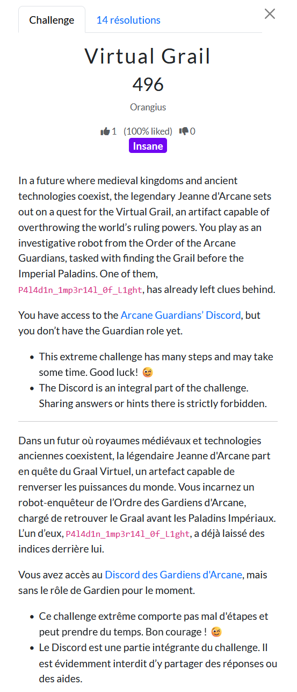

Lorsqu'on rejoint le serveur discord, nous sommes accueillis par M3rl1n_3xtr4ord1n41r3. L'accès aux autres salons est restreint pour le moment, il faudra lui un donner un mot de passe en privé pour gagner sa confiance.
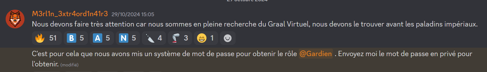


A l'aide de [Sherlock](https://github.com/sherlock-project/sherlock), on retrouve un compte sur Star Citizen.

https://robertsspaceindustries.com/en/citizens/P4l4d1n_1mp3r14l_0f_L1ght

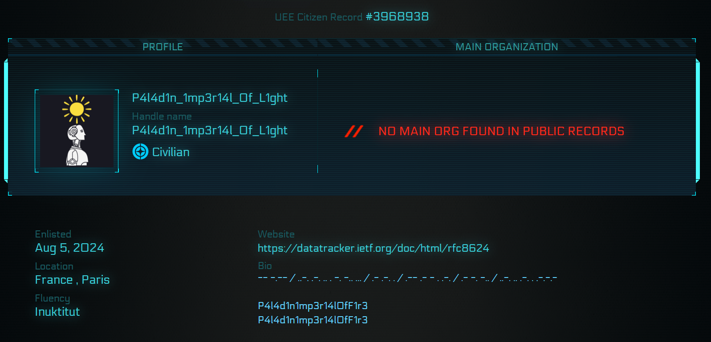

Si on traduit le morse, on obtient ``MY FRIENDS ARE WATER AND FIRE.``. Le site mène vers un RFC sur ``Algorithm Implementation Requirements and Usage Guidance for DNSSEC``.
Mais ce qui nous intéresse ici, c'est ``P4l4d1n1mp3r14l0fF1r3`` qui ressemble à un pseudo.

En réutilisant Sherlock, on retrouve un compte github lié à ce paladin.
https://github.com/P4l4d1n1mp3r14l0fF1r3


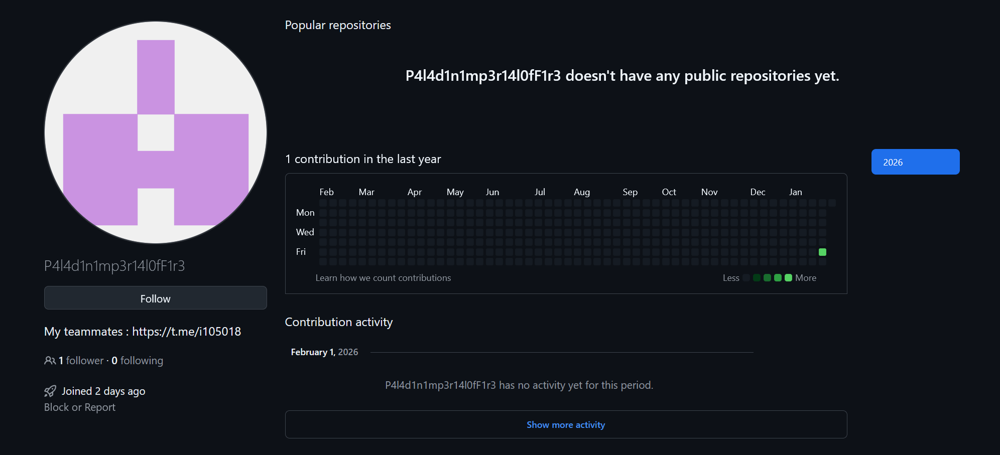

On découvre alors que les paladins ont créé un groupe Telegram où ils partagent leurs pistes pour trouver le Graal. Il y a des messages en plusieurs langues, dont en danois. Un paladin se présente et expliquent qu'un autre nommé "Ju5t1c3" serait la clé pour pouvoir infiltrer le serveur discord.

https://t.me/i105018


Si on clique sur la photo de profil, on peut retrouver une carte qui indique des coordonnées (``-9.023421,160.122665``)
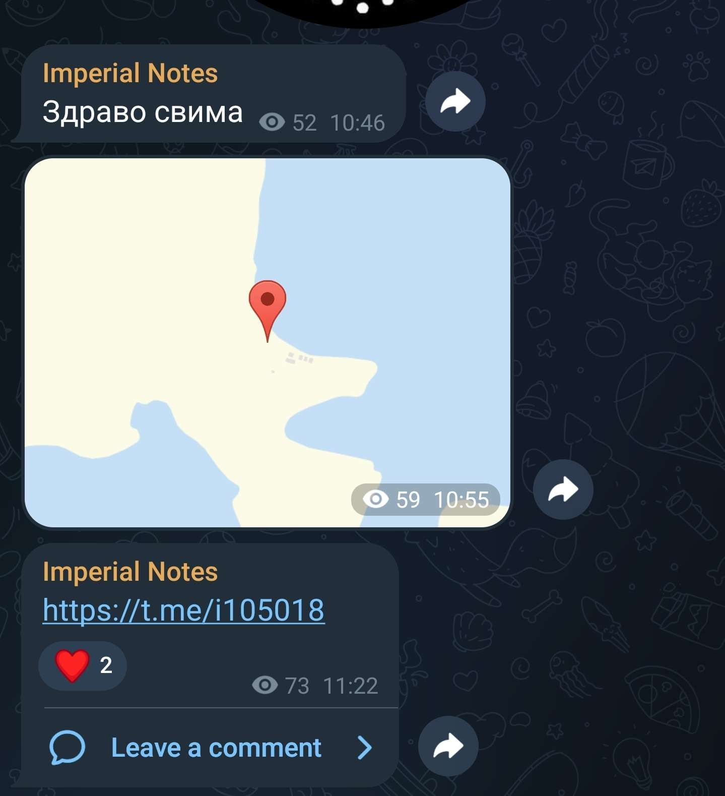

Etant donné que les noms de paladins sont presque tous sous la forme 

``P4l4d1n_1mp3r14l_0f_XXXXXX``

- P4l4d1n_1mp3r14l_0f_L1ght
- P4l4d1n_1mp3r14l_0f_R3d_D34th
- P4l4d1n_1mp3r14l_0f_D34th

On peut facilement en déduire qu'il faut chercher des infos sur ``P4l4d1n_1mp3r14l_0f_Ju5t1c3``. Ce dernier a un compte tenor associé : https://tenor.com/users/p4l4d1n_1mp3r14l_0f_ju5t1c3

Curieusement, la photo de profil de ce dernier a l'air d'avoir un hash dessus : ``5254532a2088fd117dfc7671d85c37f9``


En testant sur crackstation on obtient bien un mot de passe : ``W@chtw00rd``. Ce dernier nous permet d'obtenir le rôle Gardien.

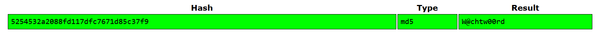


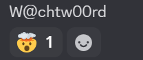

Nous avons maintenant accès à deux nouveaux salons :
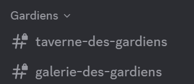

``#galerie-des-gardiens`` contient juste des descriptions de 4 gardiens fictifs.

``#taverne-des-gardiens`` est plus intéressant : M3rl1n_3xtr4ord1n41r3 poste régulièrement ce message dessus pour parler des avancements sur la recherche du Graal.


```
Nous devons faire une réunion avec tous les gardiens d'Arcane car les paladins impériaux ont apparemment obtenu un indice, nous devons essayer de le retrouver pour le lier aux notres.
@0b1-w4n-K3n0b1 a récupéré et lié nos premiers indices, au fur et à mesure ;)
```

On peut facilement retrouver un github associé à 0b1-w4n : 
https://github.com/0b1-w4n-K3n0b1

Le repo Notes va nous révéler la dernière étape du challenge. 0b1-w4n a retrouvé le Graal Virtuel dans un fichier zip mais ce dernier est protégé par un mot de passe.

Pour recomposer ce mot de passe, nous avons besoin de ces trois informations 
- Un OMI/IMO
- Le numéro de série d'un avion de type DC-3
- Le numéro d'immatriculation d'un avion de type DC-6

Nous pourrons alors recomposer le mot de passe de cette manière.
```
OMI/IMO + DC-3_AVION_REGISTRATION + DC-6_AVION_IMMATRICULATION
```

Le Gardien nous a aussi fourni deux images sur des épaves d'avions :

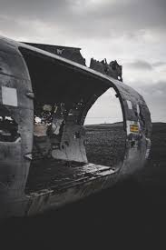


Avec des recherche inversées, on retrouve le contexte :

- DC-3
    - https://www.voyage-islande.fr/l-epave-de-l-avion-dc3-en-islande-art-345.html
    - https://en.wikipedia.org/wiki/1973_S%C3%B3lheimasandur_Douglas_C-117D_crash
  
L'avion avait le numéro de série 17171.

- DC-6 : https://www.aerosteles.net/stelefr-leperthus-dc6

L'avion DC-6 était immatriculé F-ZBBU.

Il nous reste l'IMO/OMI.
Le numéro IMO ou numéro OMI (pour Organisation maritime internationale) est un numéro qui permet d'identifier des navires. Mais de quel navire parle-t-on ?

On se rappelle alors de la conversation Telegram, il y avait des coordonnées ainsi qu'un message en danois : "Le numéro IMO sera important pour l'avenir, mes amis paladins."

Si l'on regarde les coordonnées sur Google Maps, il y a une grosse épave de bateau. Il s'agit en fait du [MS World Discoverer](https://en.wikipedia.org/wiki/MS_World_Discoverer). Ce dernier avait comme IMO 7349053.
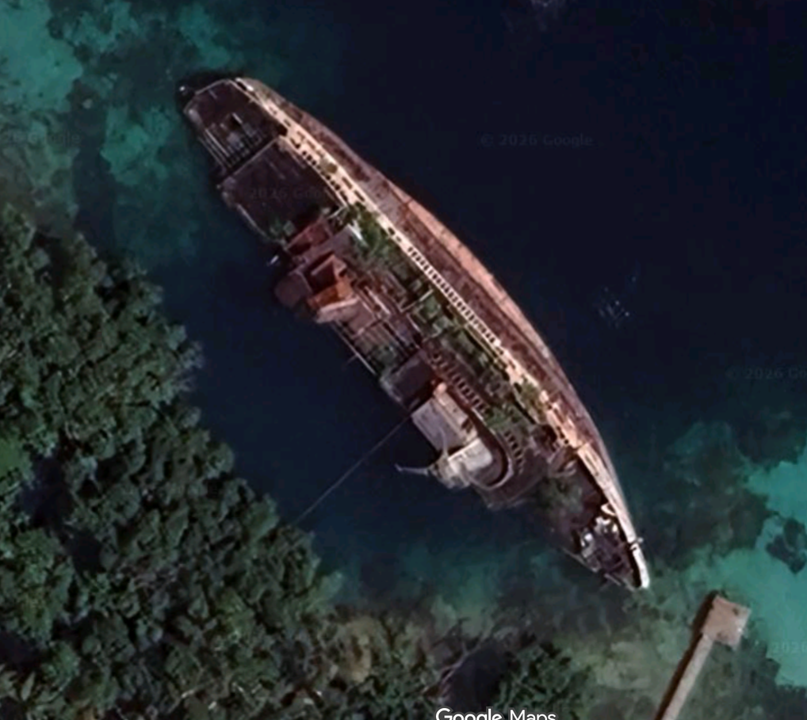

On a enfin toutes les pièces du puzzle. Le mot de passe est ``734905317171F-ZBBU`` 

Ce qui nous permet d'extraire le flag.

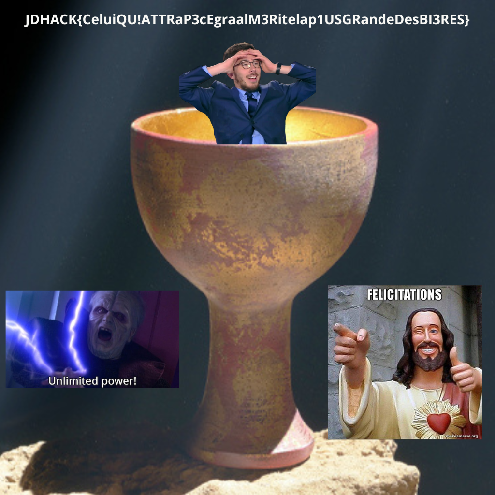


``JDHACK{CeluiQU!ATTRaP3cEgraalM3Ritelap1USGRandeDesBI3RES}``


## Bonus

Dans le repo https://github.com/0b1-w4n-K3n0b1/0b1-w4n-K3n0b1, si on regarde les commits, on remarque un commit "supersecret graal" avec un message en base64.

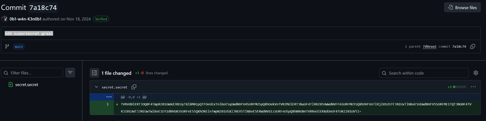

En le décodant, on retrouvait [une ressource très importante pour la suite du challenge](https://tinyurl.com/Umlja1JvbGxOb3RUaGVGbGFn) ;)
