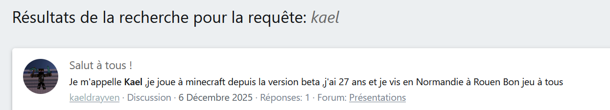
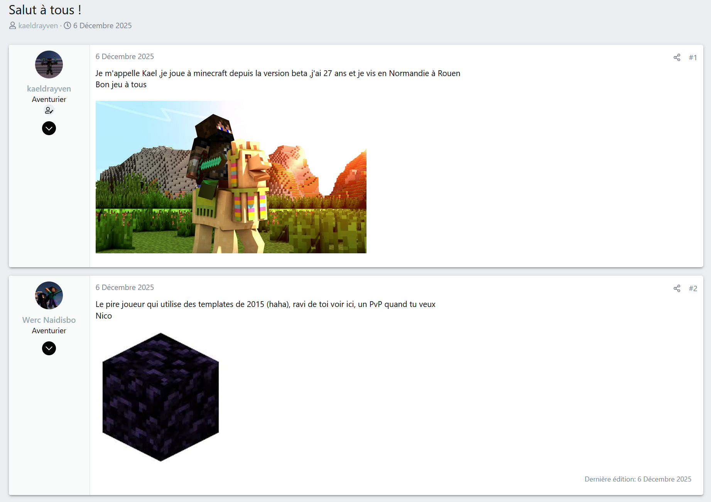
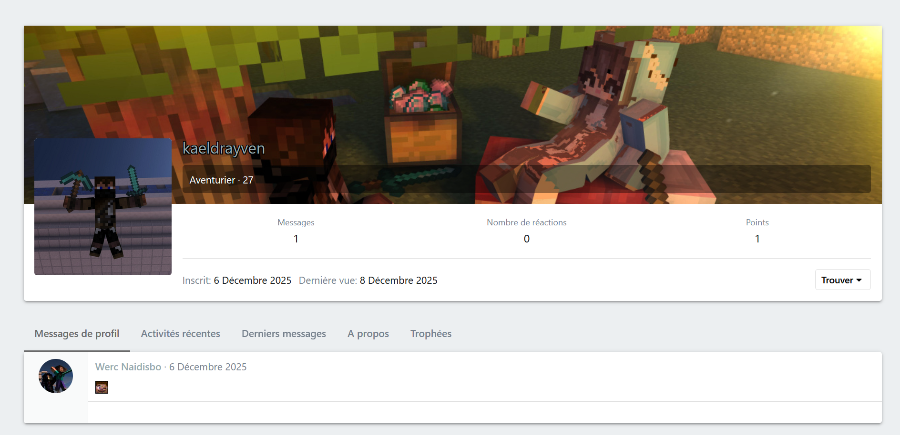
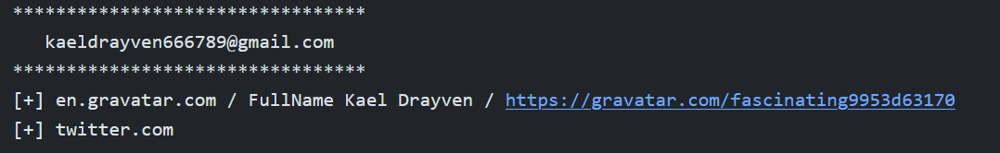
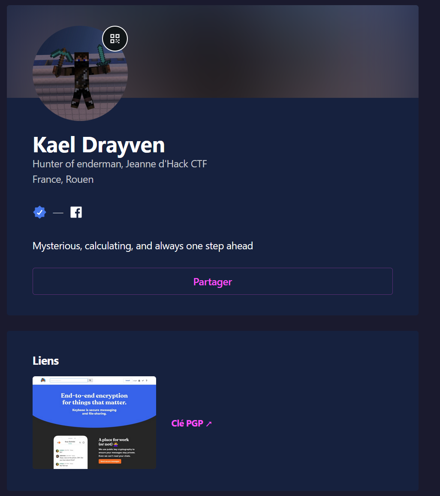
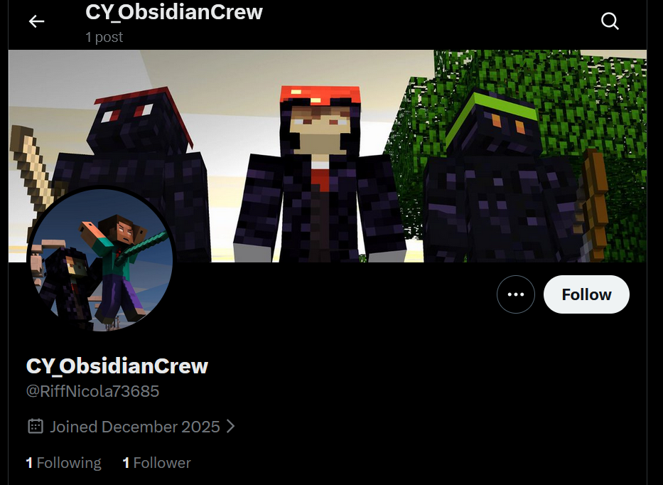
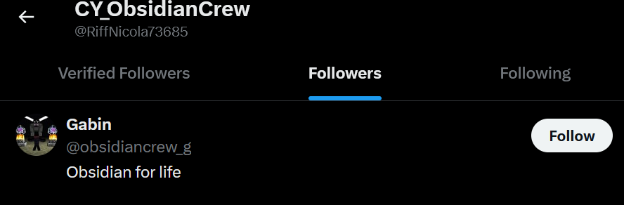
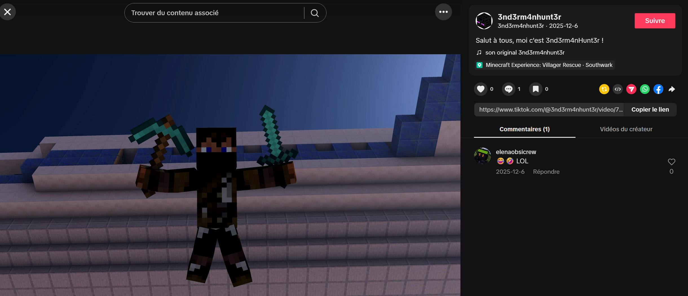
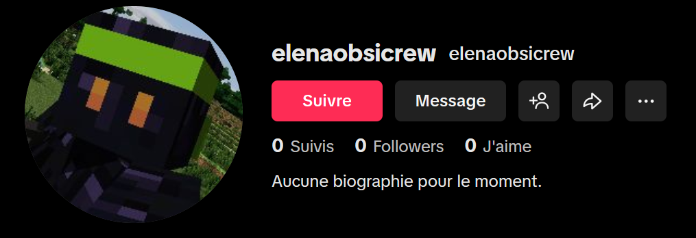

# Shadows of the End

**Difficulté** : Hard | **Points** : 500 | Catégorie : OSINT


Il faut rechercher des informations sur un dénommé ``Kael Drayven`` et les trois personnes qui le harcèlent. On sait simplement que leur prénoms commencent respectivement par un N, un G et un E.

En cherchant son nom sur Facebook, on tombe sur [un profil qui nous plait](https://www.facebook.com/people/Kael-Drayven/) : un fan de Minecraft.


Il a par la même occasion laissé son gmail : ``kaeldrayven666789@gmail.com``

Avec l'aide  [Epeios](https://epieos.com), on trouve son [Google Calendar](https://calendar.google.com/calendar/u/0/embed?src=kaeldrayven666789@gmail.com), accessible publiquement.

Ce dernier est visiblement impliqué dans une affaire de cyberharcèlement avec un certain **Nicolas** sur le forum Minecraft.fr. (Premier prénom !)


On découvre par la même occasion avec [Holehe](https://github.com/megadose/holehe) que Nicolas a un compte X/Twitter. Pas plus d'infos pour l'instant.

Un Google Dork permettait aussi de trouver son compte en testant différentes combinaisons de son pseudo.




[Kael se présente sur le forum](https://minecraft.fr/forum/threads/salut-%C3%A0-tous.277689/), mais un "Nico" de "Werc Naidisbo" (Obsidian Crew à l'envers) se moque de lui.


Le compte a bien la même photo de profil, la même bannière.
Malheureusement, il n'y a pas plus d'informations sur le profil de Kael (on sait juste qu'il est né le 11 Avril 1998) ni sur Werc. 


Avec l'aide de holehe, on trouve un compte associé à son mail sur twitter et sur gravatar. ([En rétrospective, la photo de profil sur minecraft fr venait de gravatar, ça aurait pu être un indice](https://gravatar.com/avatar/d1d0cbec8c693ed57014133ebae814d572fee4efd8091de4f0e1bb243e4e428e?s=384))


https://gravatar.com/fascinating9953d63170

Le Gravatar redirige aussi vers un keybase.

Sur Keybase, Kael Drayven possède un autre pseudo : ``3nd3rm4nhunt3r``

En décodant sa clé PGP on découvre par ailleurs un autre mail : ``3nd3rm4nHunt3r@proton.me`` (mais celui ci ne donne rien) 


Cependant 3nd3rm4nHunt3r est présent sur :
- X/Twitter
- Tiktok

En effet sur Twitter [il y a une autre confrontation entre Kael et ce bon vieux Nicolas d'Obsidian Crew qui possède la même photo de profil.](https://x.com/3nd3rm4nHunt3r/status/1997399483609497884) 


La bannière de Nicolas représente 3 personnes avec des vêtements en obsidienne : il s'agit des membres de l'Obsidian Crew.


Or [Nicolas est suivi par un Gabin](https://x.com/RiffNicola73685/followers), qui a le même skin que sur la bannière, son pseudo est également associé à Obsidian Crew. Ce qui nous permet de trouver la deuxième personne : **Gabin**



Sur TikTok, Kael a posté une [vidéo](https://www.tiktok.com/@3nd3rm4nhunt3r/video/7580847700501941526) avec la même image que sur sa photo de profil Facebook. Dans les commentaires, une autre personne se moque de lui :``elenaobsicrew`` qui a le même skin que la personne à droite de la bannière de Nico.




On a enfin le nom des trois antagonistes, leurs noms correspondent exactement aux initiales. 
- Nicolas
- Gabin
- Elena

```
JDHACK{Nicolas_Gabin_Elena}
```